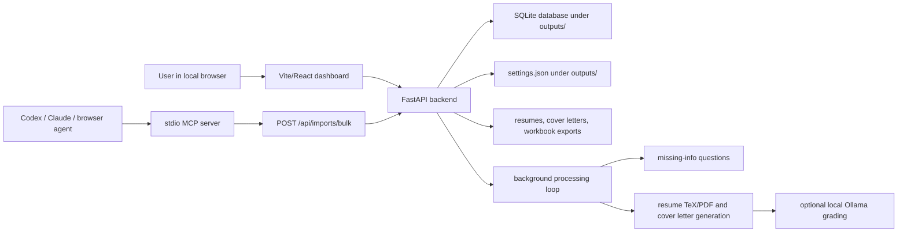

# JobFiller Documentation

Last updated: 2026-06-24

JobFiller is a local-first application preparation system. It imports job leads, tracks missing candidate facts, generates reviewable resumes and cover letters, grades drafts locally when possible, and exports apply queues. It is deliberately conservative: it prepares materials, but it does not submit applications or click final employer-site submit controls.

## Documentation Map

- [Architecture](architecture.md): system boundaries, runtime flow, storage, security model, background worker, and artifact generation.
- [Developer Guide](developer-guide.md): setup, repo orientation, development commands, testing, troubleshooting, and contribution workflow.
- [API Reference](api-reference.md): local FastAPI endpoints, authentication, request shapes, response shapes, and common errors.
- [Data Model](data-model.md): SQLite tables, relationships, lifecycle states, and local file outputs.
- [User And Agent Workflows](workflows.md): manual application prep, browser-assisted import, Gmail alert import, status sync, apply queue, and upload assistance.
- [Operations Runbook](operations-runbook.md): startup, validation, release checks, smoke tests, privacy boundaries, and recovery procedures.
- [Frontend And UX](frontend.md): dashboard pages, client API discovery, state management, test coverage, and UI extension notes.
- [MCP Integration](mcp-integration.md): Codex and Claude Code stdio bridge for job export.
- [Agent Bulk Import Contract](agent-import-contract.md): precise payload contract for `POST /api/imports/bulk`.
- [Agent Workflows](agent-workflows.md): copy-paste prompts for job-discovery agents.
- [Publishing](publishing.md): GitHub publishing workflow.
- [Release Checklist](release-checklist.md): pre-release verification checklist.

## Project In One Page



## Hard Safety Rules

- JobFiller imports and prepares data only; it never submits applications.
- Protected API routes require `X-JobFiller-Token`.
- `assist-upload` requires the explicit confirmation token `review-before-submit`.
- Public job URLs must be public `http` or `https`; localhost, private IPs, metadata/reserved IPs, and credentialed URLs are rejected.
- Personal data, runtime tokens, logs, generated resumes, generated cover letters, and exports live in ignored local directories such as `outputs/` and `artifacts/`.
- Generated application materials are drafts. Review every file before uploading it to an employer site.

## Fast Start

```powershell
.\Start-JobFiller.ps1
```

or:

```powershell
python start_jobfiller.py
```

The startup script prints the dashboard URL and writes `outputs/jobfiller-runtime.json` for local MCP clients. By default, the PowerShell launcher restarts the backend so code changes are picked up. Set `JOBFILLER_REUSE_BACKEND=true` only when intentionally reusing a running backend.

## Validation

```powershell
python scripts/verify_release.py
```

This runs backend tests, script compilation checks, doctor checks, MCP smoke tests, frontend tests/build, and startup smoke checks.
