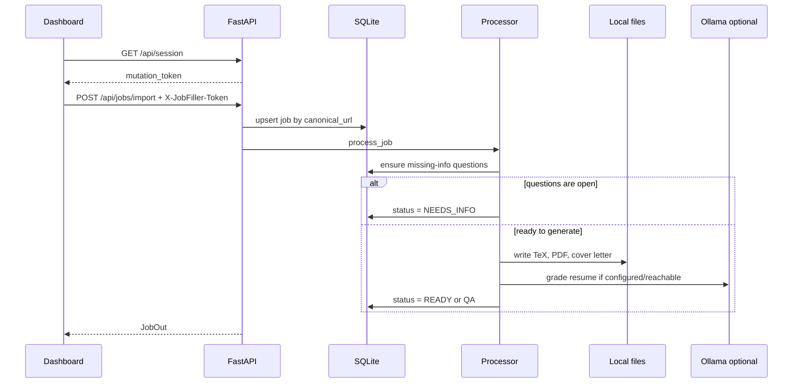

# JobFiller Architecture

Last updated: 2026-06-24

## Purpose

JobFiller is a local-first job application preparation dashboard. The core product loop is:

1. Import jobs from a URL, agent batch, browser tabs, sample seed data, or Gmail alert email.
2. Normalize and deduplicate the posting by canonical URL.
3. Detect missing candidate facts that block truthful application material generation.
4. Save reusable profile facts when the user answers questions.
5. Generate a tailored resume, LaTeX source, and cover letter.
6. Grade the resume with optional local Ollama support plus deterministic checks.
7. Export apply queues and tracking workbooks for manual review.

The system is intentionally not an application bot. Upload helpers can launch local file-assistance scripts, but submission remains a human action.

## Runtime Components

| Component | Path | Responsibility |
|---|---|---|
| FastAPI backend | `app/backend/main.py` | HTTP API, token gate, static dashboard serving, orchestration |
| Database layer | `app/backend/database.py` | SQLite engine, schema creation, local file permissions, lightweight column backfills |
| SQLAlchemy models | `app/backend/models.py` | Jobs, questions, profile facts, artifacts, grades, runs, application events |
| Settings | `app/backend/settings.py` | Default settings, local JSON merge, candidate and scan config |
| Ingestion | `app/backend/services/ingestion.py` | URL import, browser-tab import, seed scan, fit estimation |
| Gmail alert parser | `app/backend/services/gmail_importer.py` | Parse job-alert emails into import records |
| Email status sync | `app/backend/services/email_status_sync.py` | Classify application status emails and update pipeline state |
| Missing info | `app/backend/services/missing_info.py` | Detect factual gaps and create reusable questions |
| Processor | `app/backend/services/processor.py` | Job lifecycle, fact propagation, artifact staleness, grading |
| Artifact service | `app/backend/services/artifacts.py` | Resume/cover letter generation, revisions, file writes, TeX compile fallback |
| Document builder | `app/backend/services/document_builder.py` | Resume TeX, fallback PDF, and cover letter content |
| Local LLM | `app/backend/services/local_llm.py` | Ollama policy, PDF text extraction, deterministic validation, LLM grading |
| Workbook export | `app/backend/services/workbook.py` | XLSX, JSON, CSV, apply queue, follow-up views |
| Worker | `app/backend/services/worker.py` | Background loop for newest queued jobs |
| React dashboard | `app/frontend/src/main.jsx` | Jobs table, questions, facts, runs, generate queue, exports, settings |
| Frontend API client | `app/frontend/src/api.js` | API base discovery, session token handling, JSON enforcement |
| MCP server | `integrations/mcp/jobfiller_mcp_server.py` | stdio tools for agent-to-JobFiller imports |
| Launchers | `Start-JobFiller.ps1`, `start_jobfiller.py` | Dependency bootstrap, process startup, port selection, runtime config |

## Request Flow

## Startup Flow

`Start-JobFiller.ps1` is the Windows-first launcher. It creates or reuses `.venv`, installs Python runtime dependencies, starts FastAPI, verifies health, and serves the built dashboard through the backend unless dev frontend mode is requested. It restarts the backend by default so a developer does not accidentally test stale code.

`start_jobfiller.py` is the cross-platform launcher. It also creates `.venv`, installs dependencies, selects free ports, can run the Vite dev server, and writes runtime metadata. It is non-destructive and chooses free ports when defaults are busy.

Both launchers write `outputs/jobfiller-runtime.json`, which is consumed by the MCP server. That file includes the selected API base and mutation token and is intentionally ignored by Git.

## Storage Layout

| Location | Contents | Git policy |
|---|---|---|
| `outputs/jobfiller.db` | SQLite application data | ignored |
| `outputs/settings.json` | local candidate, scan, and LLM settings | ignored |
| `outputs/.jobfiller-token` | generated mutation token | ignored |
| `outputs/jobfiller-runtime.json` | launcher-written API base/token for MCP | ignored |
| `outputs/app_artifacts/` | revisioned resume and cover-letter history | ignored |
| `outputs/resumes/` | latest generated resume TeX/PDF delivery paths | ignored |
| `outputs/cover_letters/` | latest generated cover letter delivery paths | ignored |
| `outputs/jobfiller-feedback-loop.xlsx` | workbook export | ignored |
| `outputs/jobfiller-feedback-loop.json` | JSON export | ignored |
| `outputs/jobfiller-feedback-loop.csv` | CSV export | ignored |
| `artifacts/` | logs, browser/download artifacts, local generated files | ignored |
| `app/frontend/dist/` | built dashboard assets | tracked for clone-readiness |

## Authentication And Local Safety

The backend exposes `GET /api/health` and `GET /api/session` without a token. Most other `/api` routes require `X-JobFiller-Token`; public download routes are exempt so browser downloads can work cleanly. The token is either `JOBFILLER_LOCAL_TOKEN` or a generated value persisted in `outputs/.jobfiller-token`.

Import URL validation rejects malformed, credentialed, localhost, private, link-local, multicast, reserved, and unspecified IP URLs. The same validation exists in both the API and MCP bridge.

Ollama URLs are local-only by default. Remote Ollama endpoints are rejected unless `JOBFILLER_ALLOW_REMOTE_OLLAMA=1` is set.

## Job Lifecycle

Common `Job.status` values:

- `DISCOVERED`: imported but not processed.
- `PARSED`: discovered and ready for processing.
- `NEEDS_INFO`: blocked by open factual questions.
- `GENERATING`: artifact generation is in progress.
- `QA`: artifacts exist but grading or validation did not mark them ready.
- `READY`: latest artifact is graded ready to send.
- `FAILED`: import or generation failed.

`Job.application_state` tracks application pipeline emails separately from artifact generation. Common states include `DISCOVERED`, `APPLIED`, `ACTION_NEEDED`, `INTERVIEW`, and `REJECTED`.

## Artifact Lifecycle

Artifacts are revisioned. Every generation or manual text edit creates a new `Artifact` row and a revision folder under `outputs/app_artifacts/`. Latest delivery paths under `outputs/resumes/` and `outputs/cover_letters/` are refreshed for user convenience.

For resume PDFs, JobFiller tries `tectonic` first. If `tectonic` is not installed or compilation fails, it writes a fallback PDF through the local document builder. The compile status records which path was used.

Editing cover-letter or LaTeX content through the API creates a new revision. Editing LaTeX also triggers grading because the resume PDF changes.

## Background Work

The worker starts in FastAPI lifespan and stops on shutdown. Processing is mostly explicit through scan/import/reprocess endpoints, but the worker gives the app a place to continue queued local work without external infrastructure.

## Deployment Model

JobFiller is currently a local desktop/server app, not a hosted multi-tenant service. Its deployment target is a user machine with Python, optional Node for frontend development, optional `tectonic`, and optional Ollama. Publishing docs are about distributing the repository through GitHub, not deploying a public SaaS.
