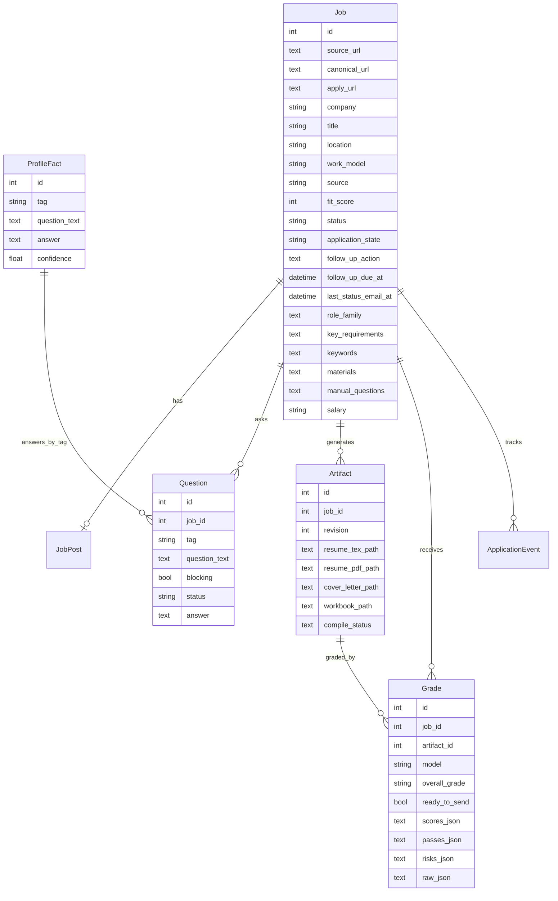

# JobFiller Data Model

Last updated: 2026-06-24

JobFiller stores application state in a local SQLite database at `outputs/jobfiller.db`. SQLAlchemy creates tables at startup and performs a small set of backwards-compatible column backfills for the `jobs` table.

## Entity Relationship Overview

## Tables

### `jobs`

Primary application-prep record. `canonical_url` is unique and is used for upserts.

Important fields:

- `source_url`: original job URL.
- `canonical_url`: normalized URL used for deduplication.
- `apply_url`: direct application URL when known.
- `source`: import source such as `manual`, `agent`, `mcp`, `gmail-alert`, or `chrome`.
- `fit_score`: integer fit estimate from `0-100`.
- `status`: artifact/prep lifecycle state.
- `application_state`: application pipeline state inferred from email status sync.
- `follow_up_action`: user-facing next action, often produced by email sync.
- `last_status_email_*`: latest evidence from application-status emails.
- `role_family`, `key_requirements`, `keywords`: tailoring inputs.
- `materials`, `manual_questions`, `salary`: user-facing application context.
- `posting_age_text`, `posted_at`, `first_seen_at`, `last_seen_at`: recency and sorting inputs.

### `job_posts`

One optional parsed/source payload per job.

Fields include `raw_text`, `raw_html`, `summary`, `parsed_requirements`, `parsed_keywords`, and `compensation`.

### `questions`

Missing-info questions produced by the rules engine.

Important fields:

- `tag`: reusable fact key. Questions with the same tag can be answered together.
- `blocking`: whether the job should remain `NEEDS_INFO` while open.
- `status`: `OPEN`, `ANSWERED`, or `SKIPPED`.
- `answer`: saved answer text after resolution.

### `profile_facts`

Reusable candidate facts keyed by unique `tag`.

When a fact changes, linked open questions can be resolved and existing artifacts that depended on older facts can be marked stale.

### `artifacts`

Revisioned generated files.

Each generation or manual edit creates a new row with a monotonically increasing `revision` per job. File paths point to the latest delivery paths, while full revision history is stored under `outputs/app_artifacts/`.

### `grades`

Resume QA results. `scores_json`, `passes_json`, `risks_json`, and `raw_json` hold model/deterministic validation payloads.

`ready_to_send` is advisory only; the user still reviews artifacts before applying.

### `runs`

Operational history for scans, imports, artifact failures, profile fact updates, Gmail sync, and other background activities.

### `application_events`

Normalized application-status email evidence. Uniqueness is `source + external_id`, so repeated syncs update existing events instead of duplicating them.

## Status Fields

### `Job.status`

| State | Meaning |
|---|---|
| `DISCOVERED` | Job exists but has not completed processing |
| `PARSED` | Job was parsed/imported and is ready for processing |
| `NEEDS_INFO` | One or more blocking questions are open |
| `GENERATING` | Artifact generation is running |
| `QA` | Artifacts exist but are not marked ready, or grading needs review |
| `READY` | Latest grade indicates materials are ready for review/send |
| `FAILED` | Import or artifact generation failed |

### `Question.status`

| State | Meaning |
|---|---|
| `OPEN` | Needs user input |
| `ANSWERED` | Has a saved answer |
| `SKIPPED` | User intentionally skipped it |

### `Run.status`

| State | Meaning |
|---|---|
| `RUNNING` | Work started but is not marked finished |
| `SUCCEEDED` | Work completed successfully |
| `FAILED` | Work caught an error or partial failure |

### `Job.application_state`

This is separate from `Job.status`. It records the employer-side pipeline state inferred from emails. Examples include `DISCOVERED`, `APPLIED`, `ACTION_NEEDED`, `INTERVIEW`, and `REJECTED`.

## Local Files And Database Rows

Artifact rows point at local files. The database is the index; the filesystem stores the actual resume PDFs, TeX, cover letters, and workbooks. If a file is manually deleted, download endpoints return `404` even if the row remains.

Generated latest paths are optimized for human use:

- `outputs/resumes/<candidate>-resume-<company>-<role>-job-0001.pdf`
- `outputs/resumes/<company>-<role>-job-0001/main.tex`
- `outputs/cover_letters/<candidate>-cover-letter-<company>-<role>-job-0001.docx`

Revision paths are optimized for auditability:

- `outputs/app_artifacts/job-0001-<company>-<role>/rev-001/resume/main.tex`
- `outputs/app_artifacts/job-0001-<company>-<role>/rev-001/<candidate>-resume-<company>-rev-001.pdf`
- `outputs/app_artifacts/job-0001-<company>-<role>/rev-001/cover_letter/<candidate>-cover-letter-<company>-rev-001.docx`

## Export Shapes

Workbook export creates sheets for:

- `Jobs`
- `Resume Tailoring`
- `Cover Letters`
- `Apply Queue`
- `Follow Ups`

JSON/CSV export uses one row per ordered job and includes current artifact paths, grade, ready flag, open question count, notes, pipeline state, follow-up information, salary, materials, and manual questions.
